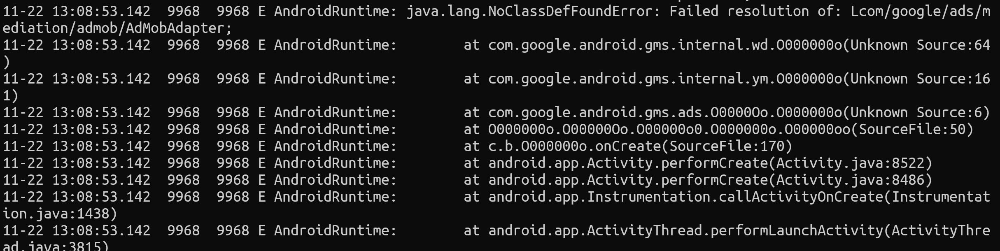
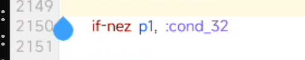
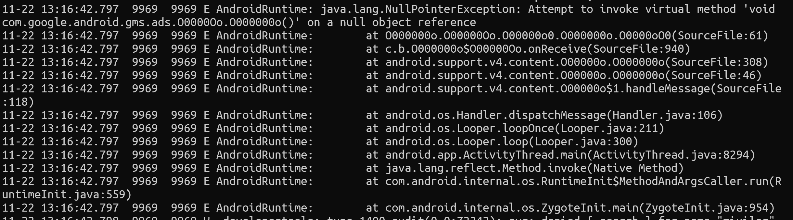
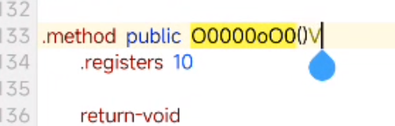

```sh
package="cn.trinea.android.developertools"
pid=$(dumpsys activity top | grep $package | grep "ACTIVITY" -A -0 | grep -o "pid=[0-9]*" | grep -o "[0-9]*")
logcat -d --pid=$pid
```





这个改成 `goto :cond_32`



直接 **return-void**

