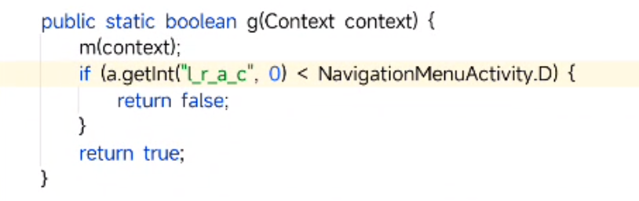
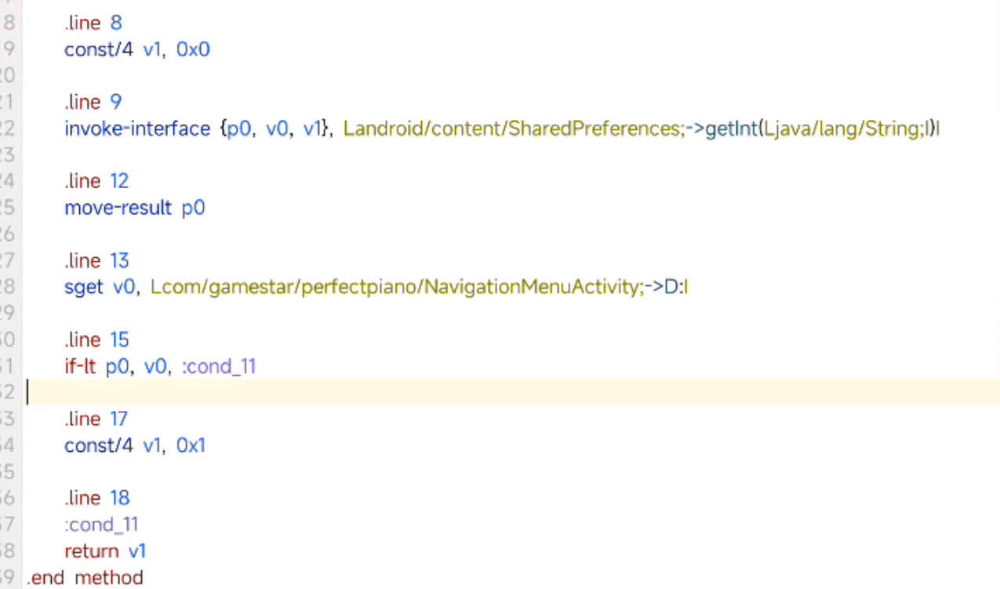

# 发现广告
1. 开屏摇一摇蠢猪广告 `com.gamestar.perfectpiano.Splash`
2. 在进行十次演奏之后，需要观看广告才允许继续
	`com.qq.e.ads.LandscapeADActivity`

```sh
pid=$(dumpsys activity top | grep "com.gamestar.perfectpiano" | grep "ACTIVITY" -A -0 | grep -o "pid=[0-9]*" | grep -o "[0-9]*")
logcat -d --pid=$pid
```

# 解决
先去除签名校验

1. 解锁十次限制

查看Activity： `com.qq.e.ads.LandscapeADActivity`
无脑删掉 `com.qq.e.ads`

此时启动到 Splash 就闪退了


> GrowMore指的是GroMore广告变现

直接删除 `growmore` 包


对应的：删除


展示开屏广告的，直接删掉方法体
发现虽然没广告了，但是一直卡在开屏，说明有个方法是调用转换屏幕的

> postDelayed经常被用于延时任务，或者定时器。

“如果没有初始化成功，就xxx” "如果初始化超时了，就调用 I()"
猜想 `I()` 就是跳过开屏的东西


把 `G()` 改成 `I()` ， 


没有说到 perfectpiano 的调用，说明是在其他地方调用了这个 Activity，暂时找不到，所以就手动回滚一下代码，取消以上的删除 `ads` 包动作，即可启动。

在点击“学习模式” —— 任一歌曲时，报错


删掉，


说明有很多地方调用这个 `loadAd` ，选择查看 `loadAd`

直接 `return-void`


打包，成功删除广告，但是 “观看视频获得10次继续机会” 还是辣眼睛

看上面的报错，是在 `com.gamestar.perfectpiano.learn.LearnModeLauncherFragment.onViewCreated` 里面的


看到有个 `n.g(getContext())` ，smali 指出是 `h/n` ：



这里的 `NavigationMenuActivity.D` 是 `10`，猜测是如果观看次数小于 10 就返回 `false` —— 不显示 “观看”， 所以这里直接让其返回 false



> if-It 如果p0小于v0

`if-lt p0, v0, :cond_11` 改成 `goto :cond_11`

**完成**