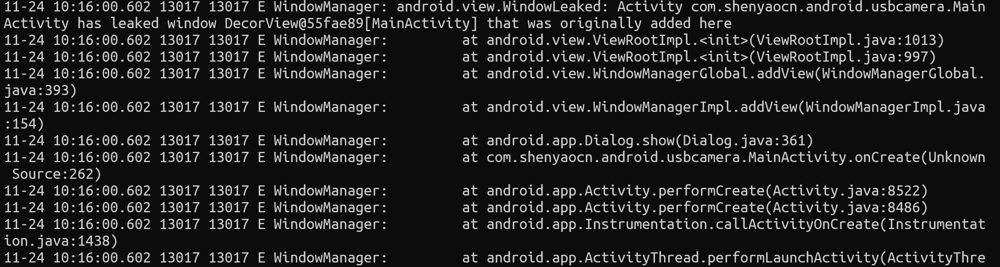
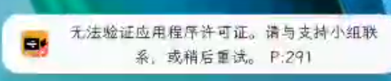
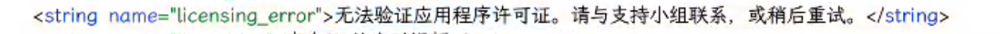
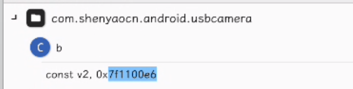
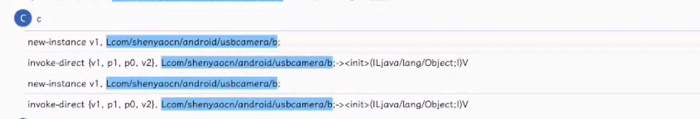
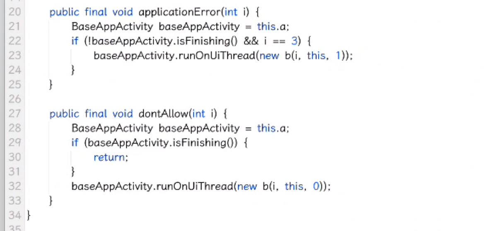
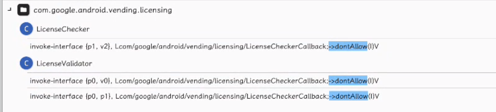
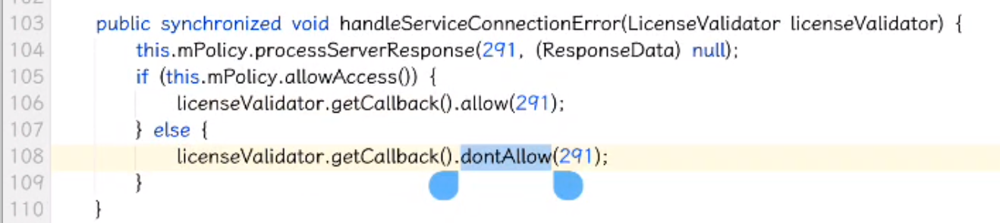
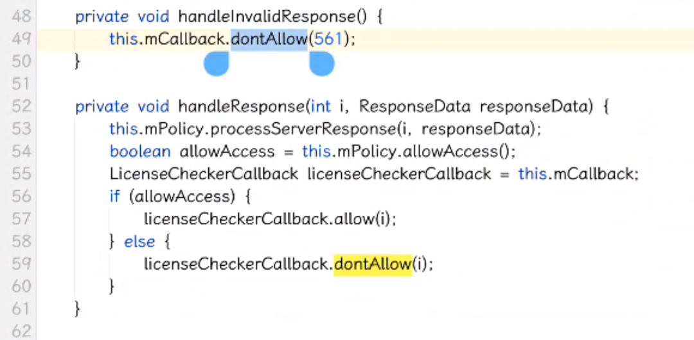
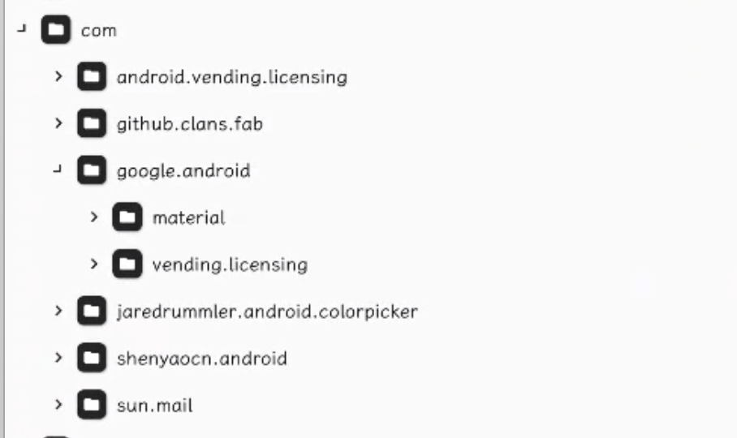

从谷歌商店安装并提取安装包之后，重新安装，启动后闪退
```sh
package="com.shenyaocn.android.usbcamerapro"
pid=$(dumpsys activity top | grep $package | grep "ACTIVITY" -A -0 | grep -o "pid=[0-9]*" | grep -o "[0-9]*")
logcat -d --pid=$pid
```



[android - Activity has leaked window that was originally added - Stack Overflow](https://stackoverflow.com/questions/2850573/activity-has-leaked-window-that-was-originally-added)



无法验证应用程序许可证

id: `7f1100e6`




所以是在某个地方 `new b(291, obj, 0).run()`
搜索 `Lcom/shenyaocn/android/usbcamera/b` ，注意有四个参数的调用




是第二个方法，搜索在哪里调用了 `dontAllow` ，搜索 `->dontAllow`



#### 第一个



直接跳转到执行 `licenseValidator.getCallback().allow(291)` 的地方
```
...
goto :cond_20
...
:cond_20
```

成功启动
#### 第二个



# 看一下广告的代码



可以看到完全不会获取广告了（笑